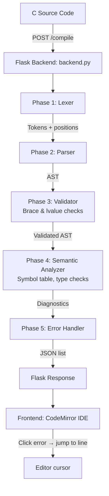
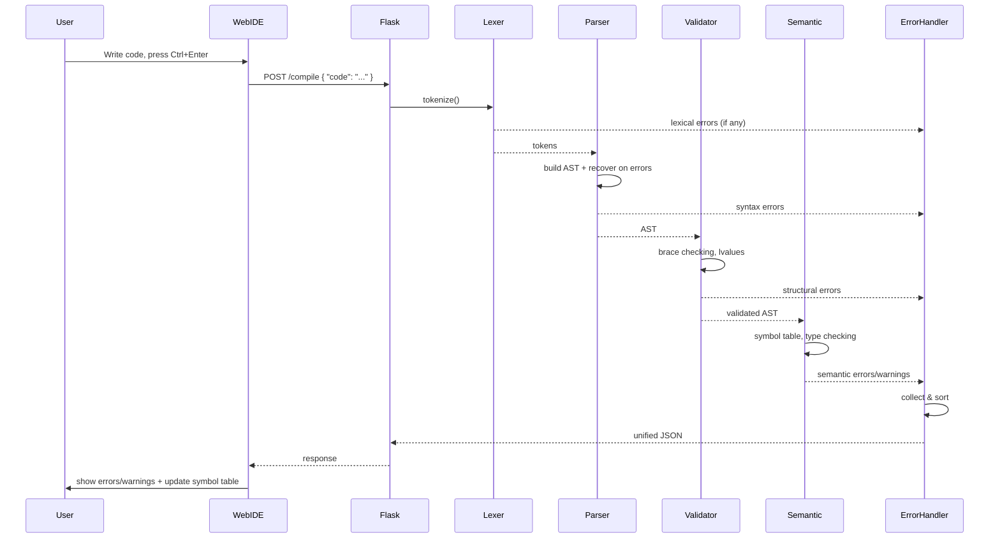

# C-Mini-Compiler – Full Diagnostic C Compiler with Web IDE

A 5‑phase compiler for a simplified C language that not only compiles but also catches **multiple syntax and semantic errors** at once, with **precise line/column reporting**. Comes with a modern dark‑mode web editor (CodeMirror) that shows live errors and warnings.

---

## 📖 Table of Contents

1. [What is this project?](#what-is-this-project)
2. [How the Compiler Works – 5 Phases](#how-the-compiler-works--5-phases)
3. [Project Flowchart](#project-flowchart)
4. [Installation & Setup](#installation--setup)
5. [Running the Compiler](#running-the-compiler)
6. [Web IDE – Features](#web-ide--features)
7. [Error Types & Warnings](#error-types--warnings)
8. [Code Structure (Files & Folders)](#code-structure-files--folders)
9. [Testing](#testing)
10. [Example Compilation Output](#example-compilation-output)

---

## What is this project?

The **C-Mini-Compiler** is an educational compiler that reads a C‑like source code, verifies its correctness, and reports **all errors and warnings** in one go – unlike a typical compiler that stops at the first mistake.

It is built as a **full‑stack web application**:
- **Backend**: Flask (Python) – runs the compiler phases.
- **Frontend**: HTML/CSS/JS with CodeMirror 6 – a rich code editor with syntax highlighting, error underlining, and clickable error messages.

### Key features
- ✅ Detects missing semicolons, unmatched braces, invalid assignments, etc.
- ✅ Warns about unused variables, type mismatches, missing return statements.
- ✅ Shows line and column numbers for every diagnostic.
- ✅ Recovers from errors (panic mode) to find more issues in one run.
- ✅ Live symbol table display (functions, variables with scopes).

---

## How the Compiler Works – 5 Phases

The compiler follows the classic structure of a **multi‑pass compiler**, but with a focus on **error collection** rather than code generation.

### Phase 1: Lexical Analysis (`src/lexer.py`)

**Task:** Break the source code into **tokens** – the smallest meaningful units (keywords, identifiers, numbers, operators, etc.).

**Example:**
```c
int x = 5;
```
→ Tokens: `int`, `x`, `=`, `5`, `;`

- Also records **line and column** of each token.
- Detects invalid characters or malformed tokens (e.g., `9var` – identifier starting with digit).

### Phase 2: Syntax Analysis – Parsing (`src/parser.py`)

**Task:** Build an **Abstract Syntax Tree (AST)** – a tree structure that represents the grammar of the program.

It uses a **recursive‑descent parser** that follows a custom C grammar (EBNF).  
**Example AST for `int x = 5;`**:
```
VarDeclNode
├── type: "int"
├── name: "x"
└── init: IntegerNode(5)
```

- The parser also checks basic grammar (e.g., `if` without parentheses).
- If a syntax error is found (e.g., missing semicolon), it reports the error and **recovers** (skips to the next statement) – this is called **panic‑mode recovery**.

### Phase 3: Syntax Validation (`src/validator.py`)

**Task:** Perform extra structural checks that are easier to do before building the AST.

- **Brace matching**: Uses a stack to verify that every `(`, `[`, `{` has a matching closing brace. Reports **unclosed** or **unexpected** braces with exact line/column.
- Checks for **lvalue validity** in assignments (e.g., `5 = x` is invalid).

### Phase 4: Semantic Analysis (`src/semantic.py`)

**Task:** Check the meaning of the program – types, scopes, variable usage.

- **Symbol Table**: Tracks every variable and function in nested scopes.
- **Type checking**: Warns when you assign a `float` to an `int` (possible data loss).
- **Division by zero**: Detects `x / 0` as an error.
- **Multiple declarations**: Flags `int a; int a;` in the same scope.
- **Unused variables**: Warns if a variable is declared but never read.
- **Missing return**: Warns if a non‑void function lacks a `return` statement.

### Phase 5: Unified Error Reporting (`src/error_handler.py`)

**Task:** Collect all errors and warnings from all phases, sort them, and output a **unified JSON** for the frontend.

Each diagnostic contains:
- `phase` – where it came from (lexical, syntax, semantic)
- `kind` – short code (e.g., `MISSING_SEMICOLON`)
- `message` – human‑readable explanation
- `line`, `column` – exact position in source
- `severity` – `error` or `warning`

---

## Project Flowchart

Below is the overall data flow of the compiler (Mermaid diagram). You can view it on [Mermaid Live](https://mermaid.live/) or in any Markdown viewer that supports Mermaid.



### Detailed Compilation Workflow (sequence)



---

## Installation & Setup

### Prerequisites
- Python 3.8 or higher
- `pip` (Python package manager)

### Steps

1. **Clone or download** the project into a folder, e.g., `C-Mini-Compiler/`.

2. **Create a virtual environment** (recommended):
   ```bash
   cd C-Mini-Compiler
   python -m venv venv
   source venv/bin/activate      # On Windows: venv\Scripts\activate
   ```

3. **Install dependencies**:
   ```bash
   pip install -r requirements.txt
   ```
   The only required packages are `flask` and `flask-cors`.

4. **Run the backend server**:
   ```bash
   python backend.py
   ```
   You should see:
   ```
   * Running on http://127.0.0.1:5001
   ```

5. **Open the web IDE**:
   - Open your browser and go to `http://127.0.0.1:5001`
   - (Or double‑click `web/index.html` – but you need the backend running for compilation)

---

## Running the Compiler

### From the command line (without web)
You can also compile a C‑Mini source file directly:
```bash
python main.py examples/sample.c
```
This prints a colored error report in the terminal.

### From the web IDE
- Type or paste your C code in the left panel (CodeMirror editor).
- Press **Ctrl+Enter** (or **Cmd+Enter** on Mac) to trigger compilation.
- The right panel shows:
  - **Errors & warnings** list (click any to jump to the line)
  - **Symbol table** (functions and variables with their scopes)

---

## Web IDE – Features

| Feature | Description |
|---------|-------------|
| Syntax highlighting | CodeMirror 6 with C‑mode (keywords, strings, comments) |
| Line numbers | Shows line numbers for easy reference |
| Error markers | Each diagnostic includes a clickable card – clicking moves the cursor to that line/column |
| Symbol table sidebar | Live display of all functions (signatures) and global/local variables |
| Dark mode | Glassmorphic design with comfortable contrast |
| Auto‑indentation | CodeMirror’s built‑in indentation |

---

## Error Types & Warnings

The compiler distinguishes between **errors** (must fix) and **warnings** (advisory).

### Syntax Errors (Phase 1-3)

| Error Kind | Example | Trigger |
|------------|---------|---------|
| `MISSING_SEMICOLON` | `int x = 5` (no `;`) | Statement ends without `;` |
| `UNCLOSED_BRACE` | `int main() {` (no `}`) | Opening brace never closed |
| `UNEXPECTED_BRACE` | `}` alone | Closing brace without match |
| `INVALID_ASSIGN` | `5 = x;` | Left side not a variable/array |
| `UNEXPECTED_TOKEN` | `int if = 10;` | Keyword used as identifier |

### Semantic Warnings / Errors

| Kind | Severity | Example | Explanation |
|------|----------|---------|-------------|
| `TYPE_MISMATCH` | Warning | `int a = 3.14;` | Possible loss of data |
| `DIVIDE_BY_ZERO` | Error | `int x = 5 / 0;` | Division by constant zero |
| `MULTIPLE_DECLARATION` | Error | `int a; float a;` | Same name in same scope |
| `MISSING_RETURN` | Warning | `int foo() { }` | Non‑void function returns nothing |
| `UNUSED_VARIABLE` | Warning | `int x = 5;` (never used) | Unused variable |

All diagnostics include **line and column** numbers.

---

## Code Structure (Files & Folders)

```
C-Mini-Compiler/
├── backend.py            # Flask server – handles /compile endpoint
├── config.py             # Port and host configuration
├── main.py               # Command‑line compiler driver
├── requirements.txt      # Python dependencies
├── run_tests.sh          # Runs all unit tests
├── setup.md              # Quick setup guide
├── readme.md             # This file
├── src/                  # Compiler core modules
│   ├── __init__.py
│   ├── compiler.py       # Orchestrates the 5 phases
│   ├── lexer.py          # Tokenization (Phase 1)
│   ├── parser.py         # Recursive‑descent parser + AST (Phase 2)
│   ├── validator.py      # Brace & lvalue checks (Phase 3)
│   ├── semantic.py       # Symbol table, type checking (Phase 4)
│   ├── symbol_table.py   # Hierarchical scope management
│   ├── syntax_checker.py # Helper for string/char literal errors
│   └── error_handler.py  # Collects & formats diagnostics (Phase 5)
├── tests/
│   └── test_compiler.py  # Unit tests (pytest‑style)
└── web/                  # Frontend files
    ├── index.html        # Main page layout
    ├── styles.css        # Dark glassmorphic styling
    └── app.js            # CodeMirror 6 + AJAX to backend
```

---

## Testing

Run the test suite to verify the compiler catches all errors correctly:

```bash
./run_tests.sh
```

This executes all test cases inside `tests/test_compiler.py`, including:
- Missing semicolon at end of line
- Unmatched braces
- Invalid assignment
- Type mismatch warnings
- Division by zero
- Multiple declarations

All tests check that the **line and column numbers** in the output match expected values.

---

## Example Compilation Output

**Input C code (with errors):**
```c
int main() {
    int x = 10
    printf("Hello");
    return 0
}
```

**JSON response (simplified):**
```json
{
  "success": false,
  "total_errors": 2,
  "total_warnings": 0,
  "errors": [
    {
      "phase": "syntax",
      "kind": "MISSING_SEMICOLON",
      "message": "missing ';' after statement (got 'printf')",
      "line": 2,
      "column": 14,
      "severity": "error"
    },
    {
      "phase": "syntax",
      "kind": "MISSING_SEMICOLON",
      "message": "missing ';' after statement (got '}')",
      "line": 4,
      "column": 12,
      "severity": "error"
    }
  ]
}
```

The web IDE shows these errors in a list, and clicking on any error moves the cursor to that line.

---

## Contributing & Further Improvements

This compiler is designed for **educational purposes**. Possible extensions:
- Add support for `struct` and `union`.
- Generate intermediate code (e.g., LLVM IR or assembly).
- Implement constant folding and optimization warnings.
- Add more semantic checks (e.g., unreachable code).

---

## License

This project is open‑source under the MIT License. Feel free to use, modify, and distribute.

---

**Happy compiling!** 🚀
